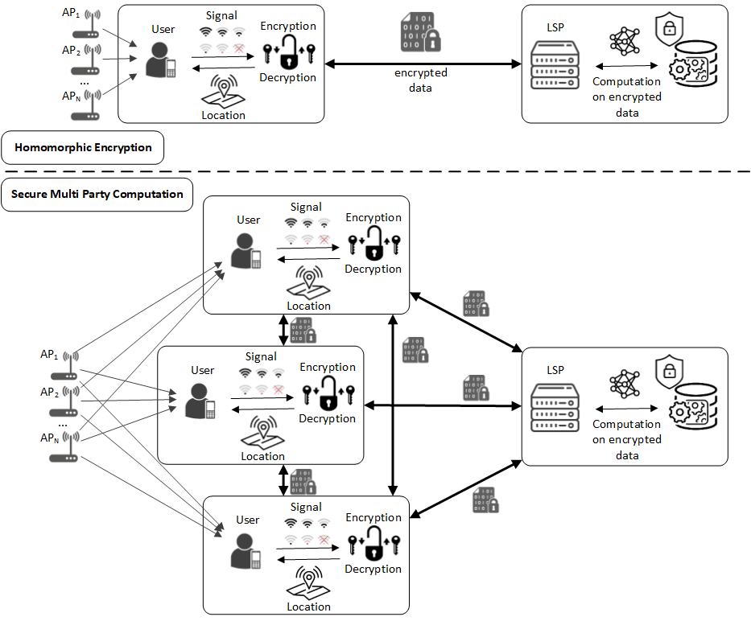
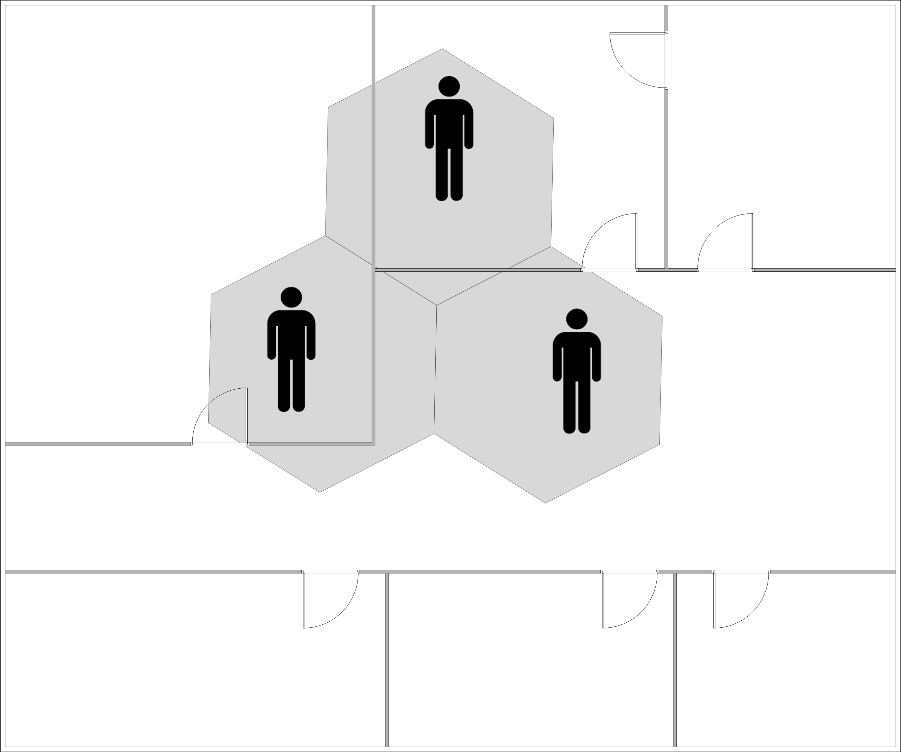
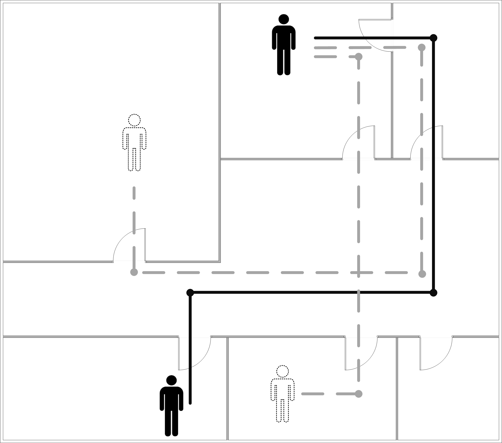
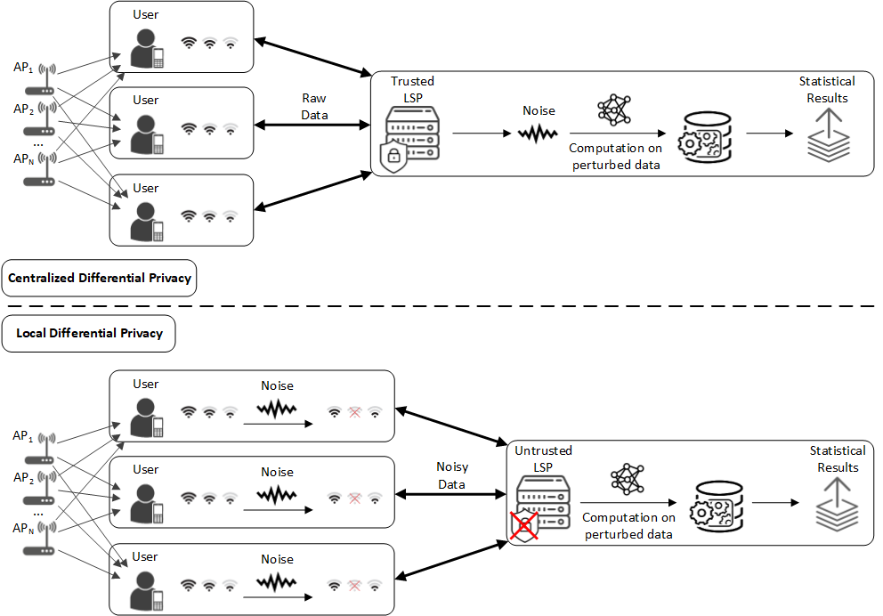
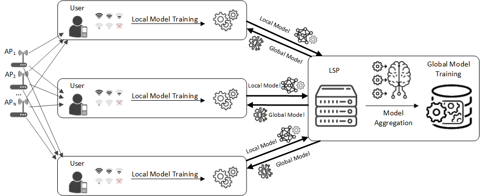

<!-- # Indoor Location Fingerprinting Privacy: A Comprehensive Survey -->
 
# A Survey and Future Outlook on Indoor Location Fingerprinting Privacy Preservation

A curated list of papers on privacy-preserving indoor fingerprinting localization.

Papers are sorted by the proposed privacy-preserving mechanism. 
These include Cryptographic Models, Anonymization, Differential Privacy, and Federated Learning.

<!-- This repository serves as a complement to the survey below.

[**Indoor Location Fingerprinting Privacy: A Comprehensive Survey**](https://arxiv.org/pdf/2404.07345) 

````bibtex
@misc{ftlz2024ilfppm,
      title={Indoor Location Fingerprinting Privacy: A Comprehensive Survey}, 
      author={Amir Fathalizadeh and Vahideh Moghtadaiee and Mina Alishahi},
      year={2024},
      eprint={2404.07345},
      archivePrefix={arXiv},
      primaryClass={cs.CR},
      url={https://arxiv.org/abs/2404.07345}, 
}
````

If you feel this repository is helpful, please cite the survey above. -->

## Quick Links
**Papers sorted by privacy-preserving mechanism:** | [Cryptographic Models](#cryptographic-models) | [Anonymization](#anonymization) | [Differential Privacy](#differential-privacy) | [Federated Learning](#federated-learning) | 

## Indoor Location Fingerprinting Privacy Preserving Mechanism (ILFPPM)

### Cryptographic Models [[Back to Top](#a-survey-and-future-outlook-on-indoor-location-fingerprinting-privacy-preservation)] 

<p align="center">

</p>


| Year | Paper | Privacy Method | Localization | Dataset |
|------|-------|---------------|--------------|---------|
| 2014 | **Achieving privacy preservation in WiFi fingerprint-based localization** | Paillier | kNN | Simulated, Private |
| 2015 | **A Privacy-Preserving Fuzzy Localization Scheme with CSI Fingerprint** | Paillier | Fuzzy Logic | CRAWDAD |
| 2016 | **Privacy-Preserving Wi-Fi Fingerprinting Indoor Localization** | Paillier | SVM | Private |
| 2018 | **The Death and Rebirth of Privacy-Preserving WiFi Fingerprint Localization with Paillier Encryption** | Paillier, Garbled Circuit | - | - |
| 2018 | **Modeling Privacy in WiFi Fingerprinting Indoor Localization** | Paillier, Garbled Circuit | - | Simulated |
| 2018 | **Received Signal Strength Quantization for Secure Indoor Positioning via Fingerprinting** | Paillier, Garbled Circuit | kNN | Private, JUIndoorLoc, Tampere Uni |
| 2019 | **Server-Side Fingerprint-Based Indoor Localization Using Encrypted Sorting** | Paillier, DGK Algorithm | kNN | Colombia Uni |
| 2019 | **On Location Privacy in Fingerprinting-Based Indoor Positioning System: An Encryption Approach** | ABY Framework, Arithmetic Sharing, Boolean Sharing, Yao's Sharing | kNN | Simulated, Private |
| 2019 | **PILOT: Practical Privacy-Preserving Indoor Localization Using OuTsourcing** | Trusted Third Party | kNN | Simulated |
| 2019 | **A Privacy-Preserving Protocol for Indoor Wi-Fi Localization** | Paillier, Spatial Bloom | kNN | - |
| 2020 | **Lightweight Privacy-Preserving Scheme in Wi-Fi Fingerprint-Based Indoor Localization** | Paillier | kNN | Private |
| 2020 | **Practical Privacy Protection Scheme In WiFi Fingerprint-based Localization** | Expectation-maximization, Bayes Network | kNN | UJIIndoorLoc |
| 2021 | **Practical Privacy-Preserving Indoor Localization Based on Secure Two-Party Computation** | Paillier, One Time Pad, Garbled Circuits | kNN | Simulated, Uni of Helsinki |
| 2022 | **FAPRIL: Towards Faster Privacy-Preserving Fingerprint-Based Localization** | Arithmetic Sharing, Delta Sharing, Yao's Sharing | kNN | Simulated |
| 2022 | **PriHorus: Privacy-Preserving RSS-Based Indoor Positioning** | Paillier | MLE | Private |
| 2024 | **Privacy-preserving indoor localization based on inner product encryption in a cloud environment** | Inner Product Encryption | kNN | Simulated, JUIndoorLoc |


### Anonymization [[Back to Top](#a-survey-and-future-outlook-on-indoor-location-fingerprinting-privacy-preservation)] 

<p align="center">
  
  
</p>

| Year | Paper | Privacy Method | Localization | Dataset |
|------|-------|---------------|--------------|---------|
| 2012 | **$K$-Anonymity in Indoor Spaces through Hierarchical Graphs** | $k$-anonymity, Hierarchical graph | - | Simulated |
| 2014 | **Location Privacy in Buildings: A 3-Dimensional $K$-Anonymity Model** | $k$-anonymity, Cloaking, Obfuscation | kNN, SVM | Simulated |
| 2015 | **Privacy-Preserving Indoor Localization on Smartphones** | $k$-anonymity, Bloom Filter | - | Simulated, CSUCY, KIOSUCY, Crawdad |
| 2016 | **Location $K$-Anonymity in Indoor Spaces** | $k$-anonymity, $\ell$-diversity, Hierarchical graph | kNN | Simulated |
| 2018 | **A Privacy Preserving Method for Crowdsourcing in Indoor Fingerprinting Localization** | Hilbert Curve, $k$-anonymity | NN | Simulated |
| 2020 | **A Low-complexity trajectory privacy preservation approach for indoor fingerprinting positioning systems** | $k$-anonymity, Randomization, Permutation | kNN | Simulated, CRI |
| 2020 | **Preserving Privacy in WiFi Localization With Plausible Dummy Locations** | $k$-anonymity | kNN | Simulated |
| 2021 | **Privacy preserving in indoor fingerprint localization and radio map expansion** | $k$-anonymity, Hilbert Curve, Bloom Filter | kNN | Simulated, CRI, CSUCY, KIOSUCY, PosData |
| 2022 | **On the privacy protection of indoor location dataset using anonymization** | $k$-anonymity, $\ell$-diversity, $t$-closeness, ($\alpha,k$)-anonymity, $\delta$-presence | - | Simulated, CRI, UJIIndoorLoc |


### Differential Privacy [[Back to Top](#a-survey-and-future-outlook-on-indoor-location-fingerprinting-privacy-preservation)] 

<p align="center">

</p>

| Year | Paper Title | Privacy Method | Localization | Dataset |
|------|-------------|----------------|--------------|---------|
| 2016 | **Privacy-preserving crowdsourced site survey in WiFi fingerprint-based localization** | CDP, Paillier | kNN | Private |
| 2017 | **CollabLoc: Privacy-Preserving Multi-Modal Localization via Collaborative Information Fusion** | LDP, Two-step classifier | - | Multi Building, Rutgers Uni |
| 2017 | **WiFi fingerprint releasing for indoor localization based on differential privacy** | LDP, Delaunay triangulation, Range generalization | - | Simulated |
| 2018 | **Application of Local Differential Privacy to Collection of Indoor Positioning Data** | LDP, Randomized Response | - | Simulated, Sangmyung Uni |
| 2018 | **DP3: A Differential Privacy-Based Privacy-Preserving Indoor Localization Mechanism** | CDP, AP fuzzification, Finger Clustering, Finger Permutation | - | PosData |
| 2018 | **P3-LOC: A Privacy-Preserving Paradigm-Driven Framework for Indoor Localization** | LDP, Segmenting Data, $k$-anonymity | - | Private |
| 2019 | **Workload-Aware Indoor Positioning Data Collection via Local Differential Privacy** | LDP, Randomized Encoding | - | Simulated, Beijing Taxi, Trajectory |
| 2022 | **Hide me Behind the Noise: Local Differential Privacy for Indoor Location Privacy** | LDP, Local Hashing, Unary Encoding, Histogram Encoding, Random response, RAPPOR | - | JUIndoorLoc, CRI |
| 2022 | **A Differentially Private Indoor Localization Scheme with Fusion of WiFi and Bluetooth Fingerprints in Edge Computing** | LDP, Edge–cloud collaboration | FSELM | Private |
| 2022 | **3D Geo-Indistinguishability for Indoor Location-Based Services** | GeoInd, Laplace Mechanism | - | Simulated |
| 2023 | **Indoor Geo-Indistinguishability: Adopting Differential Privacy for Indoor Location Data Protection** | GeoInd, Laplace Mechanism, Distance calculation, RSS Generation | - | Simulated, JUIndoorLoc, CRI |
| 2023 | **Indoor Semantic Location Privacy Protection With Safe Reinforcement Learning** | GeoInd, Reinforcement learning | - | Simulated |
| 2024 | **Preserving location privacy against inference attacks in indoor positioning system** | LDP, GeoInd | - | Geolife, Gowalla |


### Federated Learning [[Back to Top](#a-survey-and-future-outlook-on-indoor-location-fingerprinting-privacy-preservation)] 

<p align="center">

</p>

| Year | Paper Title | Privacy Method | Localization | Dataset |
|------|-------------|----------------|--------------|---------|
| 2019 | **FLoc: Fingerprint-Based Indoor Localization System under a Federated Learning Updating Framework** | AutoEncoder | DNN | Private |
| 2020 | **Pseudo Label-Driven Federated Learning-Based Decentralized Indoor Localization via Mobile Crowdsourcing** | FedAvg | SAEC | UJIIndoorLoc |
| 2020 | **Federated Learning for RSS Fingerprint-based Localization: A Privacy-Preserving Crowdsourcing Method** | FedAvg | MLP | UJIIndoorLoc |
| 2021 | **Personalized Federated Learning over non-IID Data for Indoor Localization** | FedAvg, FedAmp, FedAmp-fusion | MLP | UJIIndoorLoc |
| 2021 | **A Privacy-Preserved Online Personalized Federated Learning Framework for Indoor Localization** | FedAvg, DP | MLP | UJIIndoorLoc, Guangzhou Xinguang, Shopping Mall |
| 2022 | **Zone-Based Federated Learning in Indoor Positioning** | FedAvg | kNN, MLP, Random Forest | UJIIndoorLoc, CRI |
| 2022 | **Federated Learning-Based Localization With Heterogeneous Fingerprint Database** | FedAvg | MLP | UJIIndoorLoc |
| 2022 | **Prediction Based Semi-Supervised Online Personalized Federated Learning for Indoor Localization** | FedAvg, Knowledge distillation, Mixture of Experts | MLP | UJIIndoorLoc, Guangzhou Xinguang, Shopping Mall |
| 2022 | **Federated Learning for WiFi Fingerprinting** | FedProx | CNN, LSTM | Private |
| 2022 | **Federated Learning for Indoor Localization via Model Reliability With Dropout** | Monte Carlo Dropout | NN | UJIIndoorLoc |
| 2022 | **Multi-Level Federated Graph Learning and Self-Attention Based Personalized Wi-Fi Indoor Fingerprint Localization** | Federated Graph Learning | GNN | Guangzhou Xinguang, Shopping Mall |
| 2023 | **A Federated Learning Framework for Fingerprinting-Based Indoor Localization in Multibuilding and Multifloor Environments** | AutoEncoder | CNN, DNN | UJIIndoorLoc |
| 2023 | **Confidentiality Preserved Federated Learning for Indoor Localization Using Wi-Fi Fingerprinting** | - | CNN, LSTM | Private |
| 2023 | **FedHIL: Heterogeneity Resilient Federated Learning for Robust Indoor Localization with Mobile Devices** | AutoEncoder, FedHIL | MLP | Private |
| 2023 | **FedPos: A Federated Transfer Learning Framework for CSI-Based Wi-Fi Indoor Positioning** | Cloud Feature Extractor, Homomorphic Encryption | CNN | Simulated |
| 2023 | **Federated KNN-based Privacy-Preserving Position Recommendation for Indoor Consumer Applications** | Discrete Coordinate Encryption, Federated KNN | kNN | Private |
| 2024 | **A Three-level Federated Learning Framework for CSI Fingerprint based Indoor Localization in Multiple Servers Environment** | Inner Production | CNN | Private |
| 2024 | **Federated Distillation based Indoor Localization for IoT Networks** | Knowledge distillation, Federated distillation | DNN | Simulated, UJIIndoorLoc |
| 2024 | **A Three-Level Federated Learning Framework for CSI Fingerprint Based Indoor Localization in Multiple Servers Environment** | FedAvg | CNN | Private |
| 2024 | **Feature fusion federated learning for privacy-aware indoor localization** | FedAvg, FedSGD | MLP, LSTM | SPAWC |
| 2024 | **FeMLoc: Federated Meta-learning for Adaptive Wireless Indoor Localization Tasks in IoT Networks** | Transfer Learning, Meta-learning | kNN, SVM | UJIIndoorLoc, Tampere Uni, Uni of Minho |

